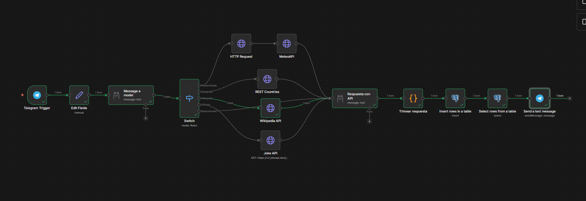
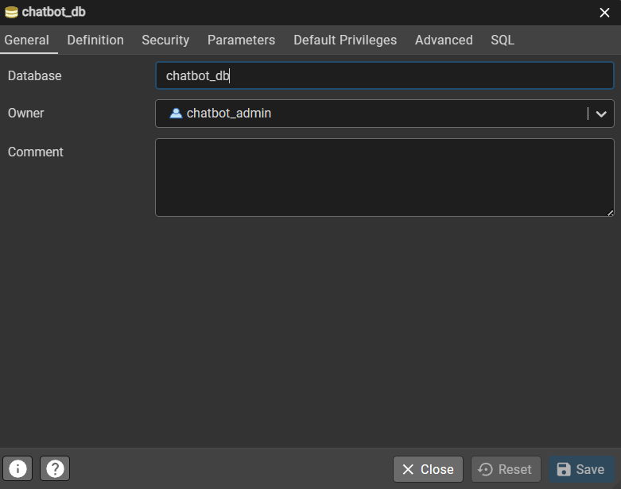
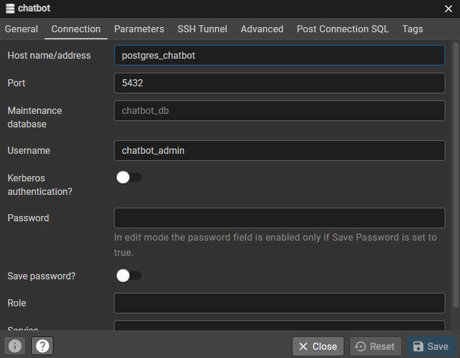

# 🤖 Chatbot Multiherramienta - Asistente de IA (n8n + Ollama + PostgreSQL)



## 📋 Descripción del Proyecto

Este proyecto forma parte del **HITO 3: Automatización Inteligente** para la asignatura de Desarrollo de Agentes IA para Web (DAIA).

Se trata de un **Chatbot Multiherramienta** diseñado e implementado íntegramente en n8n como orquestador. El bot funciona como un asistente conversacional avanzado en Telegram, siendo capaz de analizar la intención del usuario mediante un modelo LLM en local (Ollama) y enrutar la petición de manera dinámica hacia diversas APIs públicas para proporcionar una respuesta natural y en contexto. Además, cuenta con persistencia de datos almacenando el historial de conversaciones en PostgreSQL.

---

## ✨ Características Principales

1. **Recepción de Mensajes**: Integración directa con **Telegram** (Trigger de polling) para recibir las consultas de los usuarios y abstraer los datos del contexto como el `chat_id` o el `username` para identificar quién escribió el mensaje.
2. **Análisis de Intención Avanzado (Ollama)**: Utiliza `mistral:instruct` a través de la API local de Ollama como clasificador de intención. Instruido para analizar el mensaje, extraer la _palabra clave_ (entidad) y categorizar la consulta en 5 posibles intenciones devolviendo un formato JSON:
   - 🌤️ **Meteorología**: Preguntas sobre el clima, temperatura o tiempo.
   - 🌍 **Geografía**: Información variada sobre países, como por ejemplo la capital y superficie.
   - 📚 **Wikipedia**: Resúmenes y descripciones de entes o términos concretos.
   - 😂 **Chistes**: Peticiones para contar chistes (humor).
   - ❓ **Desconocido**: Cualquier otra entrada la cual no coincida con las categorías permitidas.
3. **Enrutamiento Inteligente (Switch & HTTP Requests)**: Mediante el nodo _Switch_, n8n decide automáticamente qué serie de APIs o lógica seguir:
   - **Open-Meteo API**: Sistema de doble llamada para geolocalizar primero la población y posteriormente consultar su clima.
   - **REST Countries API**: Recupera información geográfica variada.
   - **Wikipedia API**: Extrae los resúmenes de la red enciclopédica.
   - **JokeAPI**: Sirve chistes aleatorios (traducidos luego al español).
4. **Respuesta Natural y Amigable (Ollama)**: Se vuelve a utilizar a Ollama para humanizar la respuesta. Se le inyectan los datos crudos aportados por las integraciones de las APIs (JSON) y las categorizaciones del usuario, generando un texto plano conversacional adaptado al contexto (por ej., resume o traduce los chistes en su caso).
5. **Persistencia del Historial (PostgreSQL)**: A través de los nodos de inserción y selección de bases de datos, cada interacción interactiva (ID de chat, usuario, mensaje original y respuesta del agente, fecha) queda registrada en una tabla estructurada llamada `chatbot_db` del backend para consulta analítica.
6. **Despliegue Multi-servicio (Docker)**: Proyecto enteramente orquestado vía `docker-compose.yml`, levantando los servicios de n8n, PostgreSQL y pgAdmin.

---

## 🏗 Arquitectura y Componentes

El esquema general del bot sigue la siguiente ruta principal:

`Usuario de Telegram ➡️ Trigger n8n ➡️ Ollama (Extrae Intención/Entidad en JSON) ➡️ Nodo Switch (Routing a APIs API HTTP) ➡️ Ollama (Redacta texto en función de la respuesta obtenida en la API) ➡️ Código JavaScript (Formatea para tener concordancia con la Base de Datos) ➡️ Inserción en PostgreSQL (Guarda logs) ➡️ Respuesta al Usuario (Telegram)`

### Gestión de Bases de Datos Local (PostgreSQL & pgAdmin)

Para la preservación a largo plazo de los mensajes de los comandos despachados, empleamos bases de datos relacionales integradas de manera local por el Compose, proveyendo a n8n del entorno apropiado para almacenar logs.





---

## 🚀 Guía de Instalación y Despliegue

### Requisitos Previos

- **Docker** y **Docker Compose V2+** instalados en tu sistema huésped.
- **Ollama** instalado localmente y configurado. Se requiere de descargar el modelo principal del workflow: `ollama pull mistral:instruct`.
- Un Bot de **Telegram** activo (obtener token a través de _BotFather_ en tu cuenta).
- Git para el control de versiones.

### Pasos Iniciales

1. **Clonar el repositorio**:

   ```bash
   git clone agentes-n8n
   cd chatBotN8nFJFMS
   ```

2. **Levantar los servicios (Contenedores Docker)**
   Usar el archivo `docker-compose.yml` en la carpeta `/docker`, para arrancar la base de datos PostgreSQL, su gestor visual pgAdmin y la aplicación principal n8n.

   ```bash
   docker-compose up -d
   ```

3. **Configuración de la Interfaz n8n**:
   - Accede de forma local a tu n8n a través del navegador: `http://localhost:5678`.
   - Crea e inyecta las credenciales oportunas en el sistema para: **PostgreSQL** (usuario `chatbot_admin`, contraseña `chatbot`), la API local de **Ollama** (Para el proyecto hemos utilizado Jarvis: http://jarvis.ieshlanz.es) y la cuenta de **Telegram API**.
   - Haz click en _Import from File_ y selecciona el empaquetado final: `n8n/workflows/chatbot-multiherramienta.json`.
   - Asigna las credenciales, activa tu workflow en la esquina superior derecha y comienza a chatear con él.

4. **Testing Unitario para APIs Externas**:
   A lo largo del proyecto, tienes disponible el archivo `tests/pruebas.http`. Puedes usar herramientas como _REST Client_ (VS Code) para comprobar independientemente que tu máquina tiene conectividad regular contra las diversas llamadas, como ser _Open-Meteo_ y la latencia propia de _Ollama_.

---

## 🎥 Demostración y Ejemplos

Se ha creado un vídeo demostrativo para mostrar el funcionamiento del chatbot.

https://youtu.be/d3ZSXNGQoPo

---

## 👥 Contribuidores

Desarrollado integralmente para la práctica evaluable:

- _Francisco Javier Fernández Hernández_
- _Mateo Sáez Álvarez_
