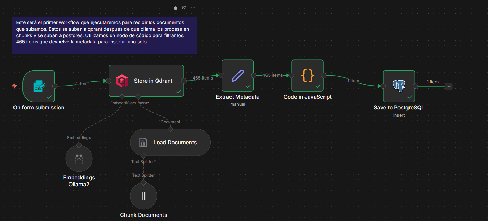
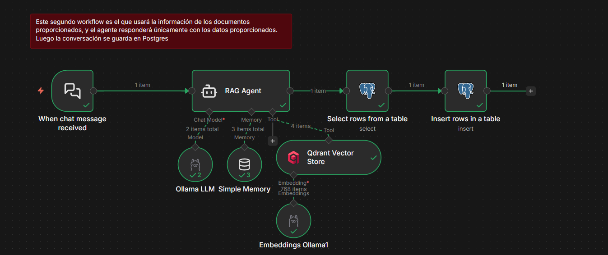
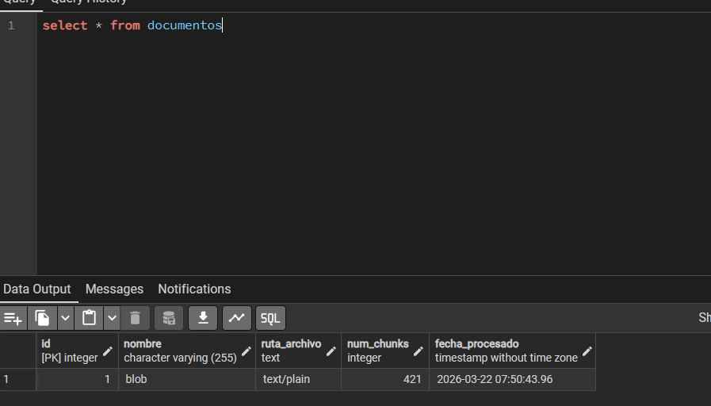
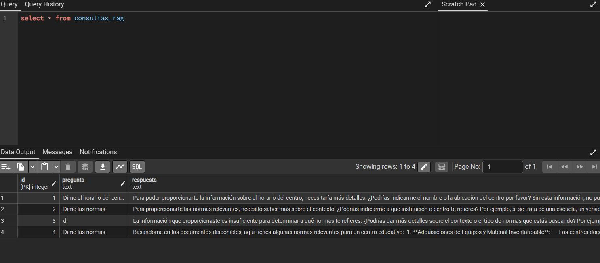

# 🚀 HITO 3: Sistema RAG Educativo (Retrieval-Augmented Generation)

Este proyecto forma parte de la entrega del **HITO 3: Automatización Inteligente** de la asignatura Desarrollo de Agentes IA para Web del ciclo de Grado Superior 2º DAW. 

Esta solución implementa un sistema RAG capaz de ingestar documentos, procesarlos, vectorizarlos mediante Ollama y Qdrant, y posteriormente permitir realizar consultas semánticas al contenido aportado, manteniendo la memoria en una base de datos PostgreSQL.

## 🏗️ Arquitectura y Tecnologías

El ecosistema está construido a partir de 4 pilares fundamentales orquestados bajo contenedores:

- **n8n**: Motor de orquestación visual que define los flujos de "Ingesta de Documentos" y "Consultas RAG". Se conecta directamente con el host local para aprovechar la GPU.
- **Ollama**: Proveedor de modelos de lenguaje local (LLM). Utilizado tanto para generar `embeddings` de los documentos/preguntas como para componer las respuestas generadas en lenguaje natural.
- **Qdrant**: Motor de base de datos vectorial que almacena y busca los fragmentos (chunks) más relevantes en base a búsquedas semánticas.
- **PostgreSQL**: Base de datos relacional orientada al almacenamiento de los registros de los archivos subidos al sistema y el historial completo del chat RAG. Se adjunta **pgAdmin** para administrar y comprobar visualmente las tablas generadas.

---

## 🚀 Instalación y Despliegue

### Requisitos previos
- Docker (v24+) y Docker Compose V2.
- Ollama instalado en la máquina host con un modelo funcional (ej. `ollama pull mistral`).

### Pasos
1. **Configurar el entorno**:
   Renombra el archivo base de variables de entorno para habilitar las configuraciones y credenciales de la base de datos.
   ```bash
   cd docker
   cp .env.example .env
   ```

2. **Levantar la infraestructura**:
   Usa Docker Compose para inicializar y ligar todos los servicios.
   ```bash
   docker compose up --build -d
   ```
   *Nota: La bandera `-d` lo lanza en background.*

3. **Verificar servicios**:
   - **n8n**: [http://localhost:5678](http://localhost:5678)
   - **pgAdmin**: [http://localhost:5050](http://localhost:5050)
   - **Qdrant**: [http://localhost:6333/dashboard](http://localhost:6333/dashboard)

---

## 📂 Estructura de Carpetas

La organización de este proyecto sigue la siguiente topología de archivos:

```text
hito3-automatizacion/
│
├── 📂 docker/
│   ├── docker-compose.yml     # Archivo de orquestación principal
│   ├── .env.example           # Plantilla de variables de entorno
│
├── 📂 n8n/
│   └── 📂 workflows/
│       └── rag-ingesta-consultas.json  # Flujos n8n exportados para evaluación manual
│
├── 📂 postgres/
│   └── init.sql               # Script SQL de creación de tablas e índices RAG
│
└── README.md                  # Referencia principal del repositorio
```

---

## 📸 Capturas del Proyecto

A continuación se muestran las evidencias de la correcta configuración y ejecución del proyecto, exigidas para la máxima calificación según la rúbrica de evaluación:

**Captura 1: Vista general del workflow de Ingesta en n8n mostrando los nodos de chunking, Qdrant y subida a PostgreSQL.**


**Captura 2: Vista general del workflow de Consultas en n8n (RAG) integrando el flujo LLM con Ollama.**


**Captura 3: Interfaz de Qdrant mostrando las colecciones creadas con el archivo subido.**


**Captura 4: pgAdmin mostrando la tabla 'documentos' poblada.**


**Captura 5: pgAdmin mostrando la tabla 'consultas_rag' con datos de historial reales.**


---

## 🎥 Vídeo Demostrativo
Video explicativo donde se muestra el funcionamiento del flujo

> **📺 Enlace al vídeo en YouTube**
https://youtu.be/SSEzXct4g1s

*En este vídeo se explica la arquitectura orquestada, se realiza la ingesta demostrativa de un documento, varias consultas interactivas haciendo uso del ecosistema RAG, y una visualización técnica validando PostgreSQL y Qdrant con sus colecciones resultantes.*
